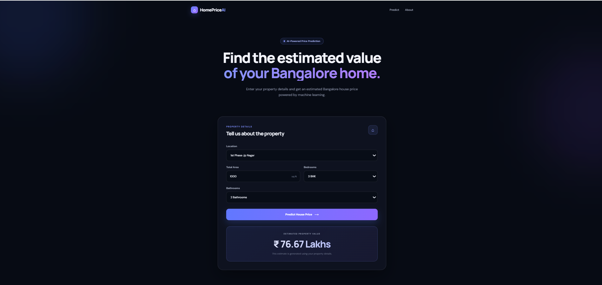

# Bangalore House Price Prediction


A machine learning web application that predicts Bangalore house prices based on property details such as location, total area, number of bedrooms, and bathrooms.

## Features

- Bangalore location selection
- House area input in square feet
- BHK selection
- Bathroom selection
- Machine learning-based price prediction
- Modern responsive frontend
- Flask REST API backend

## Machine Learning Workflow

1. Data cleaning and preprocessing
2. Feature engineering
3. Outlier removal
4. One-hot encoding of location
5. Train-test split
6. Model training and comparison
7. Hyperparameter tuning
8. Linear Regression model selection
9. Model serialization using Pickle
10. Flask API integration
11. Frontend integration

## Tech Stack

### Machine Learning
- Python
- NumPy
- Pandas
- Scikit-learn
- Pickle

### Backend
- Flask
- Flask-CORS

### Frontend
- HTML
- CSS
- JavaScript

## Project Structure

ML-pr-1/

├── client/
│   ├── index.html
│   ├── script.js
│   └── style.css
│
├── model/
│   ├── banglore_home_prices.pickle
│   ├── columns.json
│   └── real_estate_price_prediction.py
│
├── server/
│   ├── server.py
│   └── util.py
│
├── requirements.txt
├── .gitignore
└── README.md

## API Endpoints

### Get Locations

GET:

`/get_location_names`

Returns the available Bangalore locations used by the model.

### Predict House Price

POST:

`/predict_home_price`

Accepts:

- `total_sqft`
- `location`
- `bhk`
- `bath`

Returns the estimated property price in lakhs.

## How to Run

### 1. Install dependencies

```bash
pip install -r requirements.txt